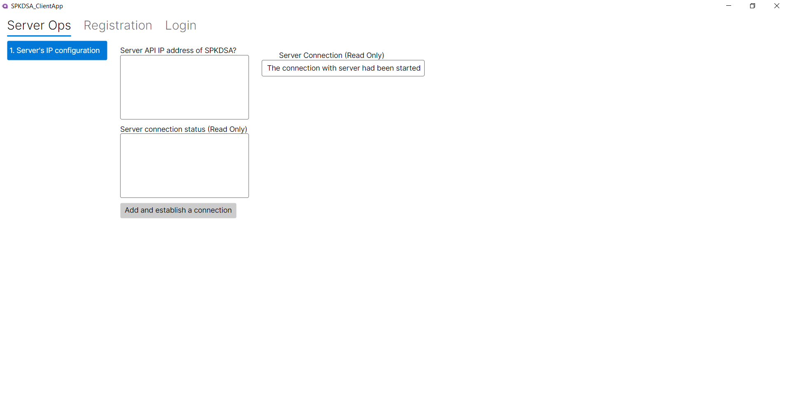
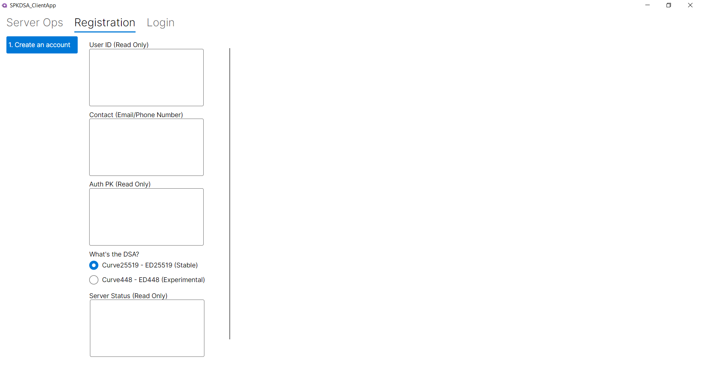

# Hindrance
Most authentication are still relying on passwords (Something we know), migrating to public key authentication (Something we have) will face a certain extent of users' obstacles.

Although this very simplified framework does make life easier for developers, the user adoption side will still be an issue.

# Suggested modifications (Client side)

**Client desktop application (Demonstration) - Configuring Server IP Address**

**Client desktop application (Demonstration) - Client registration**

Inside the client application folder, there'll have one folder called **Users**, there'll have a lot of information and folder created.
For the client side, they must not randomly share and distribute the generated private key to anyone that they don't trust.
If they did do that or they lost the private key, using the **contact** field or data can request for public key resetting on server side. 

**Client desktop application (Demonstration) - Client Login**

**Client desktop application (Demonstration) - Client reset account**

1. If the server IP address will not be changing, the dynamic adding and configuring of API IP address can be hardcoded into the client side application.
2. If there's no such need for client to click on the login button after filling in their **contact**, you can also move that function to backend so that it'll be triggered everytime the application launch.

# Suggested modifications (Server side)
Since the framework is intentionally simplified, the server side does not provide built-in logic for email-based or SMS/phone number-based account recovery.  
Implementers are expected to extend the framework with additional recovery mechanisms according to their requirements (e.g., email verification, SMS OTP, or custom recovery flows).
